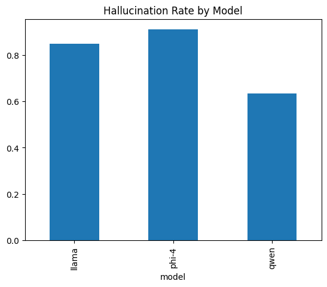
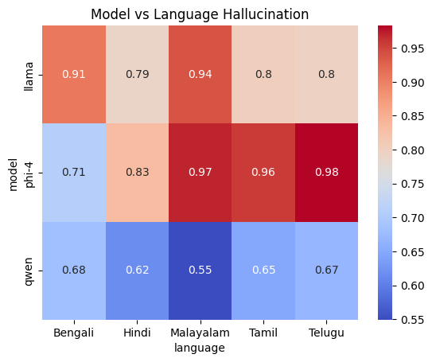
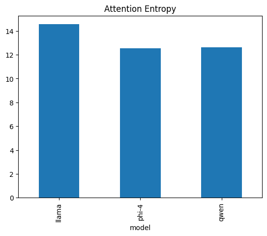
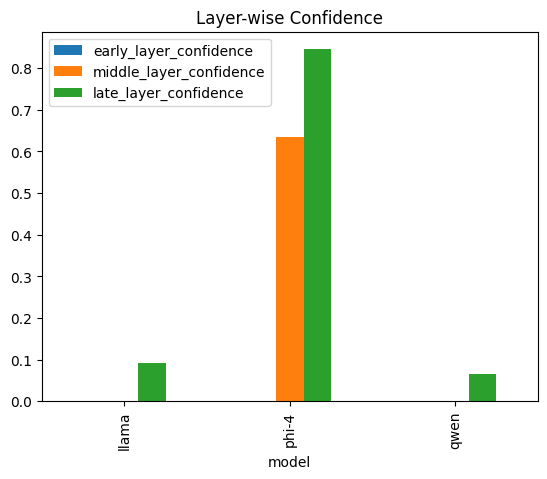

# Multilingual Hallucination Evaluation in Large Language Models

## Overview

This repository presents a multilingual evaluation framework for analyzing hallucination behavior in Large Language Models (LLMs) across Indian languages. The study investigates both surface-level hallucination patterns and internal mechanistic behaviors using semantic similarity metrics, translation validation, and interpretability analysis.

The evaluation is conducted using the TruthfulQA benchmark across five Indian languages:

- Hindi
- Bengali
- Telugu
- Tamil
- Malayalam

Three architecturally distinct LLMs are evaluated:

- Phi-4
- Qwen 1.5
- LLaMA-2

---

## Research Motivation

Most hallucination benchmarks focus primarily on English. However, multilingual hallucination behavior remains underexplored, particularly in morphologically rich and low-resource Indian languages.

This work investigates:

- Whether hallucination behavior changes across languages
- The influence of language families on hallucination rates
- Whether hallucinations arise from translation artifacts or internal model behavior
- Internal attention and confidence dynamics during generation

---

## Key Contributions

- Multilingual hallucination evaluation framework
- Cross-language hallucination benchmarking
- Translation noise validation analysis
- Entity consistency analysis
- Mechanistic interpretability evaluation
- Attention entropy and self-attention analysis
- Layer-wise confidence progression analysis
- Statistical confidence estimation of hallucination rates

---

## Models Evaluated

| Model | Description |
|------|------|
| Phi-4 | English-optimized reasoning-oriented model |
| Qwen 1.5 | Multilingual deterministic generation model |
| LLaMA-2 | Fluent autoregressive conversational model |

---

## Languages Evaluated

### Indo-Aryan Languages
- Hindi
- Bengali

### Dravidian Languages
- Telugu
- Tamil
- Malayalam

---

## Evaluation Pipeline

```text
English Question
       ↓
NLLB Translation
       ↓
Multilingual LLM Generation
       ↓
Back Translation
       ↓
Semantic Evaluation + Mechanistic Analysis
```

---

## Evaluation Metrics

### Surface-Level Metrics

- Semantic Similarity
- Hallucination Rate
- Drift Score
- Repetition Score
- Length Ratio

### Mechanistic Metrics

- Attention Entropy
- Self-Attention Ratio
- Layer-wise Confidence
- Logit Lens Confidence Progression

### Additional Validation Metrics

- Translation Noise Analysis
- Answer vs Translation Gap
- Entity Consistency
- Statistical Confidence Intervals

---

## Repository Structure

```text
data/
│
├── raw/                 -> Original multilingual generations
├── processed/           -> Phase-1 and Phase-2 evaluated outputs
└── cleaned_final/       -> Final cleaned UTF-8 datasets

figures/                 -> Experimental graphs and visualizations

notebooks/
├── inference/           -> Generation notebooks
└── evaluation/          -> Evaluation notebooks

paper/                   -> IEEE paper and related material

results/
└── tables/              -> Final aggregated CSV tables

src/
├── inference/           -> Model generation code
├── translation/         -> NLLB translation utilities
├── metrics/             -> Evaluation metrics
├── mechanistic/         -> Attention and confidence analysis
└── utils/               -> Configurations and language mappings
```

---

## Key Findings

- Qwen demonstrates the lowest hallucination rate across all evaluated languages.
- Telugu and Malayalam exhibit higher hallucination rates compared to Hindi and Bengali.
- Translation noise alone does not explain multilingual hallucination behavior.
- Mechanistic indicators strongly correlate with hallucination generation.
- Attention entropy and confidence instability are associated with increased hallucinations.
- Hallucination behavior depends on both model architecture and language family.

---

## Experimental Results

### Hallucination Trends

- Phi-4 exhibits the highest hallucination rate and unstable confidence progression.
- LLaMA-2 generates fluent but factually inconsistent outputs.
- Qwen demonstrates relatively stable multilingual behavior.

### Translation Validation

The analysis shows that translation introduces a relatively uniform noise floor, but hallucination differences remain significantly larger than translation inconsistencies.

### Mechanistic Insights

- Higher attention entropy correlates with unstable reasoning behavior.
- Stable confidence progression correlates with factual consistency.
- Qwen maintains focused attention patterns during generation.

---

## Sample Visualizations

### Hallucination Rate by Model



### Model vs Language Heatmap



### Attention Entropy



### Layer-wise Confidence



---

## Technologies Used

- Python
- PyTorch
- Hugging Face Transformers
- Sentence Transformers
- NLLB-200
- TruthfulQA
- Pandas
- Scikit-learn
- Matplotlib
- Seaborn

---

## Installation

```bash
pip install -r requirements.txt
```

---

## Citation

If you use this repository or build upon this work, please cite:

```text
Madda Sujitha and Golla Srividya,
"Multilingual Hallucination Evaluation in Large Language Models Across Indian Languages",
2026.
```

---

## Authors

**Madda Sujitha**
**Golla Srividya**

---

## License

This project is released under the MIT License.
